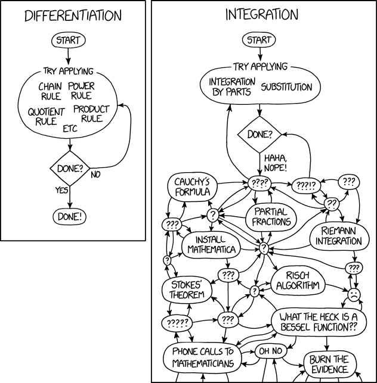
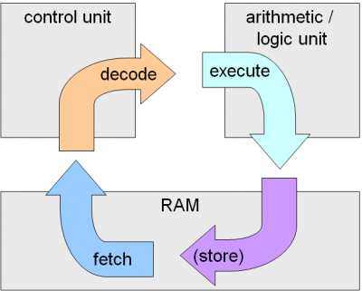

# What does a computer do?

- Performs __computation__
  + A billion calculation per second!

- __Remembers__ results
  + 100s of GB of storage!

## What kinds of calculation?

- Built-into the languages
- Ones that you define as the programmer

# Types of knowledge?

- __Declarative knowledge__ $\rightarrow$ _that_ something is the case (very
  general)
  + J is the tenth letter of the alphabet
  + Paris is the capital of France
  + Windows OS is stupid!
  + Brain is used for thinking

- __Imperative Knowledge__ $\rightarrow$ _how_ to do something (Job dependent)
   
  + Recipe 
  + factorial(n) = n * factorial(n-1)

# A numerical example

Square root of a number $x$ is $y$ if $y*y \approx x$.

- Recipe
  1. Start with a __guess__, $g$
  2. if $g*g$ __close enough__ to $x$, stop and say $g$ is the answer.
  3. Otherwise make a __new guess__ by averaging $g$ and $x/g$
  4. Using the new $g$, __repeat__ process until close enough to $x$

$g$    |    $g*g$     | $x/g$  | $(g+x/g)/2$
-------+--------------+--------+------------
3.00000| 9.00000      | 1.33333| 2.16667
2.16667| 4.69444      | 1.84615| 2.00641
2.00641| 4.02568      | 1.99361| 2.00001
2.00001| 4.00004      | 1.99999| 2.00000

# Recipe == Flow Charts

{#fig:f2 width=7cm}

# Computers are machines

{#fig:fig2 width=5cm} 
{#fig:fig3 width=5cm}

# Programming languages

- Turing showed that 6 primitives are enough to computer anything!
- Modern languages has more convenient set of primitives e.g., `if then else`,
  `for`, `while`, `&&`, `~` etc.
- can abstract methods to __create new primitives__

- _anything computable in one language is computation in any other programming
  language_

__Some things are easier in some languages.__

# Aspect of languages

- English: __words__
- programming languages: numbers, string, simple operators

{width=6cm}
{width=4cm}

^[Image credit: Michael Twardos]

# Syntax and Semantics (meaning)

__Syntax__

- English
   + "cat dogs boy" (invalid syntax)
   + "cat hugs boy" (valid syntax)

- Programming language
   + `"hi" - 5` (invalid Python syntax)
   + `3.2 * 4` (valid python syntax)

__Semantics__

- Natural language e.g., English: Multiple meanings are possible. ``"Flying
  planes can be dangerous."`` (__context dependent__)
- Programming languages: have only one meaning (__context independent__) but may
  not be __what programmer intended__ (aka bugs!).

# Introduction to Python

- Objects 
  + Program manipulates __data objects__.
  + Types: objects have a type.
  + Objects are 
     - scalar (cannot be subdivided) e.g, `int`, `float`, `bool`, `None`
     - non-scalar e.g., `string`, `list`, `dict` etc.
  + Casting

- Expression
  + combine objects and operators $\rightarrow$ expressions.
  + `lhs <operator> lhs` e.g., `lhs = rhs`, `type(lhs) == type(rhs)`
  + 

- Binding
- Functions
